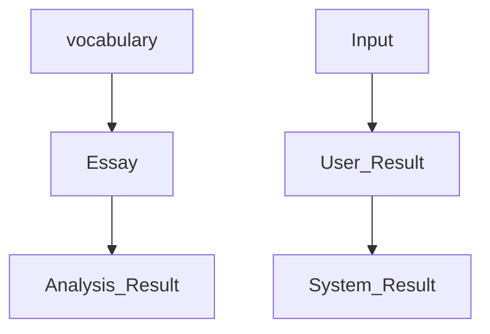

# Project Moogeul

[Youtube](https://www.youtube.com/watch?v=AZV8ilgvDL0)
[Huggingface Space](https://huggingface.co/spaces/seriouspark/project-moogeul-en)

## Service Summary
- A chatbot that suggests writing topics and analyzes emotions in the entered text, providing results.
- Suggest writing topic and report sentimental analysis from user's writings. 

### Purpose

- To extract emotions embedded in the text and create a service that allows reflection through these emotions.
- To experience various tasks related to natural language processing and apply suitable aspects to this service.

### Features

- Provides a space for people who want to write, to compose their essays.
- Once an essay is completed, it analyzes the author's emotions and provides statistics on words related to those emotions.

### Expected Effects

- Users can understand their own patterns of word usage.
- By comparing word-emotion usage patterns across authors, unique characteristics can be identified.

## Service Structure

### Process

| 내용 | 필요 데이터셋 | 필요 모델링 | 기타 필요항목 |
| --- | --- | --- | --- |
| 1. Providing a ‘writing’ space for composing an essay when a word is entered | dictionary.com | - | gradio |
| 2. Sentence-wise emotion label classification | Korean Sentiment Analysis Data (58,000 cases) + Simplified Labels (60 to 6) | xlm-roberta |  |
| 3. Extracting nouns and adjectives in sentences using nltk | Korean -> English Translation | nltk | - |
| 4. Pairing nouns, adjectives with emotion labels for frequency aggregation | - | - | - |# project-moogeul-en
